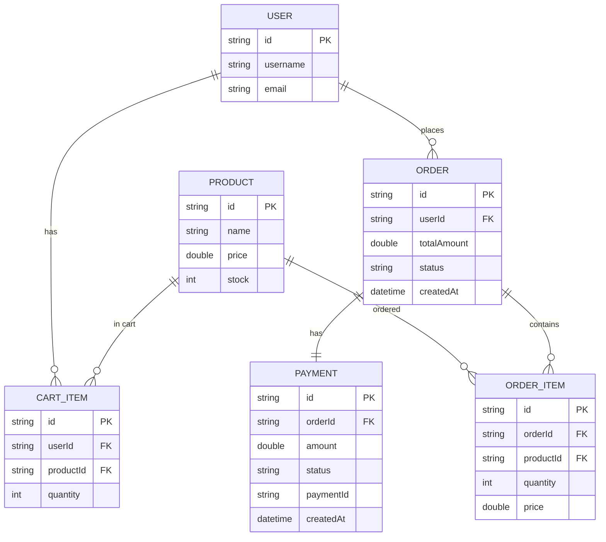

# Entity Relationship Diagram

## Database Schema - ER Diagram

This document contains the Entity Relationship Diagram for the E-Commerce Backend System.

### ER Diagram (Mermaid Format)

## Entity Descriptions

### USER
- **id**: Primary Key (String/UUID)
- **username**: User's username
- **email**: User's email address
- **role**: Optional user role

### PRODUCT
- **id**: Primary Key (String/UUID)
- **name**: Product name
- **description**: Product description (optional)
- **price**: Product price (Double)
- **stock**: Available stock quantity (Integer)

### CART_ITEM
- **id**: Primary Key (String/UUID)
- **userId**: Foreign Key → USER.id
- **productId**: Foreign Key → PRODUCT.id
- **quantity**: Quantity in cart

### ORDER
- **id**: Primary Key (String/UUID)
- **userId**: Foreign Key → USER.id
- **totalAmount**: Total order amount (Double)
- **status**: Order status (CREATED, PAID, FAILED, CANCELLED)
- **createdAt**: Order creation timestamp

### ORDER_ITEM
- **id**: Primary Key (String/UUID)
- **orderId**: Foreign Key → ORDER.id
- **productId**: Foreign Key → PRODUCT.id
- **quantity**: Quantity ordered
- **price**: Price at time of order (snapshot)

### PAYMENT
- **id**: Primary Key (String/UUID)
- **orderId**: Foreign Key → ORDER.id (One-to-One relationship)
- **amount**: Payment amount (Double)
- **status**: Payment status (PENDING, SUCCESS, FAILED)
- **paymentId**: External payment ID (Razorpay/Mock)
- **createdAt**: Payment creation timestamp

## Relationships

- **USER → CART_ITEM**: One-to-Many (One user has many cart items)
- **USER → ORDER**: One-to-Many (One user places many orders)
- **PRODUCT → CART_ITEM**: One-to-Many (One product can be in many carts)
- **PRODUCT → ORDER_ITEM**: One-to-Many (One product can be in many orders)
- **ORDER → PAYMENT**: One-to-One (One order has one payment)
- **ORDER → ORDER_ITEM**: One-to-Many (One order has many items)

## Database Collections (MongoDB)

The following collections are used in MongoDB:
- `users`
- `products`
- `cart_items`
- `orders`
- `order_items`
- `payments`

## Notes

- All IDs are String/UUID type for MongoDB compatibility
- Status fields use Enums in code (OrderStatus, PaymentStatus) but stored as strings in database
- Price is stored as Double for decimal precision
- Order status transitions: CREATED → PAID/FAILED/CANCELLED
- Payment status transitions: PENDING → SUCCESS/FAILED
- ORDER_ITEM.price is a snapshot of product price at order time (price lock)
